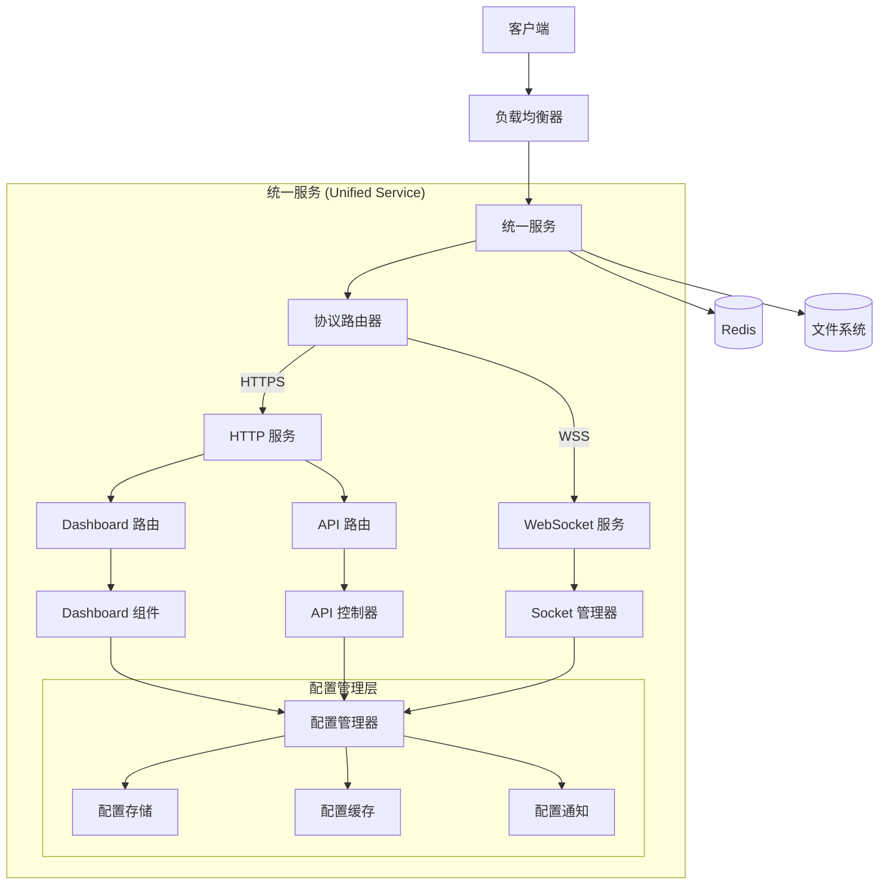

# Design Document

## Overview

本设计文档描述了将 dashboard 项目合并到主项目中的架构方案。通过统一的服务入口，根据协议头区分 HTTPS 和 WSS 协议，并实现集中化的配置管理系统。设计目标是创建一个高内聚、低耦合的统一服务架构，同时保持现有功能的完整性和性能。

## Architecture

### 整体架构



### 服务层次结构

1. **协议路由层**: 根据请求协议头区分 HTTP/HTTPS 和 WebSocket/WSS
2. **应用服务层**: 处理 Dashboard UI 和 API 请求
3. **WebSocket 服务层**: 处理实时通信连接
4. **配置管理层**: 统一管理所有配置参数
5. **数据存储层**: Redis 缓存和文件系统存储

## Components and Interfaces

### 1. 协议路由器 (Protocol Router)

```typescript
interface ProtocolRouter {
    route(request: IncomingMessage): 'http' | 'websocket';
    setupHttpHandler(app: Express): void;
    setupWebSocketHandler(io: Server): void;
}
```

**职责:**
- 检测请求协议类型
- 路由到相应的处理器
- 维护协议处理器的生命周期

### 2. 配置管理器 (Configuration Manager)

```typescript
interface ConfigurationManager {
    // 配置获取
    get<T>(key: string): Promise<T>;
    getAll(): Promise<ConfigurationData>;
    
    // 配置更新
    set(key: string, value: any): Promise<void>;
    update(config: Partial<ConfigurationData>): Promise<void>;
    
    // 配置监听
    subscribe(key: string, callback: (value: any) => void): void;
    unsubscribe(key: string, callback: (value: any) => void): void;
    
    // 配置验证
    validate(config: Partial<ConfigurationData>): ValidationResult;
}

interface ConfigurationData {
    redis: RedisConfig;
    jwt: JWTConfig;
    api: APIConfig;
    server: ServerConfig;
    dashboard: DashboardConfig;
}
```

### 3. 统一服务启动器 (Unified Service Launcher)

```typescript
interface UnifiedServiceLauncher {
    start(): Promise<void>;
    stop(): Promise<void>;
    restart(): Promise<void>;
    getStatus(): ServiceStatus;
}

interface ServiceStatus {
    http: boolean;
    websocket: boolean;
    dashboard: boolean;
    configuration: boolean;
}
```

### 4. Dashboard 集成器 (Dashboard Integrator)

```typescript
interface DashboardIntegrator {
    setupRoutes(app: Express): void;
    setupConfigurationUI(): void;
    setupStaticAssets(): void;
    buildDashboard(): Promise<void>;
}
```

### 5. 配置 UI 组件

```typescript
interface ConfigurationUI {
    // 配置表单组件
    renderConfigForm(config: ConfigurationData): React.Component;
    
    // 配置验证
    validateForm(formData: any): ValidationResult;
    
    // 配置保存
    saveConfiguration(config: ConfigurationData): Promise<void>;
    
    // 实时配置更新
    subscribeToUpdates(callback: (config: ConfigurationData) => void): void;
}
```

## Data Models

### 配置数据模型

```typescript
interface RedisConfig {
    enabled: boolean;
    host: string;
    port: number;
    password?: string;
    db: number;
    prefix: string;
    url?: string;
    tls: boolean;
}

interface JWTConfig {
    secret: string;
    expiresIn: string;
    issuer: string;
    audience: string;
}

interface APIConfig {
    key: string;
    rateLimiting: {
        enabled: boolean;
        maxRequests: number;
        windowMs: number;
    };
    cors: {
        origin: string[];
        credentials: boolean;
    };
}

interface ServerConfig {
    port: number;
    host: string;
    environment: 'development' | 'production' | 'test';
    logLevel: 'debug' | 'info' | 'warn' | 'error';
}

interface DashboardConfig {
    enabled: boolean;
    title: string;
    theme: 'light' | 'dark' | 'auto';
    features: {
        configManagement: boolean;
        monitoring: boolean;
        logs: boolean;
        metrics: boolean;
    };
}
```

### 配置变更事件模型

```typescript
interface ConfigurationChangeEvent {
    key: string;
    oldValue: any;
    newValue: any;
    timestamp: Date;
    source: 'ui' | 'api' | 'system';
    userId?: string;
}
```

## Error Handling

### 配置错误处理

```typescript
class ConfigurationError extends AppError {
    constructor(
        message: string,
        public readonly configKey: string,
        public readonly validationErrors?: ValidationError[]
    ) {
        super(message, 400, 'CONFIGURATION_ERROR', true);
    }
}

class ConfigurationValidationError extends ConfigurationError {
    constructor(configKey: string, validationErrors: ValidationError[]) {
        super(
            `Configuration validation failed for ${configKey}`,
            configKey,
            validationErrors
        );
    }
}
```

### 服务启动错误处理

```typescript
class ServiceStartupError extends AppError {
    constructor(
        message: string,
        public readonly service: string,
        public readonly cause?: Error
    ) {
        super(message, 500, 'SERVICE_STARTUP_ERROR', false);
    }
}
```

## Testing Strategy

### 单元测试

1. **配置管理器测试**
   - 配置读取和写入
   - 配置验证逻辑
   - 配置变更通知

2. **协议路由器测试**
   - HTTP/WebSocket 协议识别
   - 路由逻辑正确性

3. **Dashboard 集成器测试**
   - 路由设置
   - 静态资源服务

### 集成测试

1. **服务启动测试**
   - 统一服务启动流程
   - 多协议同时服务
   - 配置热更新

2. **配置管理集成测试**
   - Dashboard UI 配置更新
   - WebSocket 服务配置应用
   - 配置持久化

### 端到端测试

1. **完整工作流测试**
   - 通过 Dashboard 修改配置
   - WebSocket 连接使用新配置
   - 配置变更实时生效

2. **性能测试**
   - 统一服务性能基准
   - 配置读取性能
   - 并发连接处理

## Implementation Details

### 项目结构重组

```
project-root/
├── src/
│   ├── server/
│   │   ├── unified-service.ts          # 统一服务入口
│   │   ├── protocol-router.ts          # 协议路由器
│   │   ├── config/                     # 配置管理
│   │   │   ├── manager.ts              # 配置管理器
│   │   │   ├── storage.ts              # 配置存储
│   │   │   ├── cache.ts                # 配置缓存
│   │   │   └── validator.ts            # 配置验证
│   │   ├── dashboard/                  # Dashboard 集成
│   │   │   ├── integrator.ts           # Dashboard 集成器
│   │   │   ├── routes.ts               # Dashboard 路由
│   │   │   └── build.ts                # Dashboard 构建
│   │   └── ... (existing structure)
│   └── dashboard/                      # Dashboard 源码 (移动到 src 下)
│       ├── components/
│       │   ├── config/                 # 配置管理组件
│       │   │   ├── ConfigForm.tsx      # 配置表单
│       │   │   ├── ConfigEditor.tsx    # 配置编辑器
│       │   │   └── ConfigValidator.tsx # 配置验证器
│       │   └── ... (existing components)
│       └── ... (existing structure)
├── config/                             # 配置文件目录
│   ├── default.json                    # 默认配置
│   ├── development.json                # 开发环境配置
│   └── production.json                 # 生产环境配置
└── ... (existing files)
```

### 配置管理实现

1. **配置存储策略**
   - 文件系统: 持久化配置存储
   - Redis: 配置缓存和分布式同步
   - 内存: 高频访问配置缓存

2. **配置更新流程**
   - Dashboard UI 提交配置变更
   - 配置验证和预检查
   - 配置持久化存储
   - 配置缓存更新
   - 服务配置热更新
   - 变更通知广播

3. **配置安全性**
   - 敏感配置加密存储
   - 配置访问权限控制
   - 配置变更审计日志

### 协议路由实现

1. **协议检测逻辑**
   ```typescript
   function detectProtocol(req: IncomingMessage): 'http' | 'websocket' {
       const upgrade = req.headers.upgrade;
       const connection = req.headers.connection;
       
       if (upgrade === 'websocket' && 
           connection?.toLowerCase().includes('upgrade')) {
           return 'websocket';
       }
       
       return 'http';
   }
   ```

2. **路由分发机制**
   - HTTP 请求路由到 Express 应用
   - WebSocket 请求路由到 Socket.IO 服务
   - 共享中间件和配置

### Dashboard 集成实现

1. **构建时集成**
   - Next.js 应用构建到 dist/dashboard
   - 静态资源服务集成
   - API 代理配置

2. **运行时集成**
   - Dashboard 路由注册
   - 配置 API 端点
   - 实时数据推送

## Security Considerations

### 配置安全

1. **敏感信息保护**
   - JWT Secret 加密存储
   - API Key 哈希存储
   - Redis 密码加密传输

2. **访问控制**
   - 配置管理权限验证
   - API 端点访问控制
   - 配置变更审计

### 网络安全

1. **协议安全**
   - HTTPS 强制重定向
   - WSS 安全连接
   - CORS 策略配置

2. **输入验证**
   - 配置参数验证
   - API 请求验证
   - XSS 防护

## Performance Optimization

### 配置访问优化

1. **多级缓存**
   - L1: 内存缓存 (最快访问)
   - L2: Redis 缓存 (分布式共享)
   - L3: 文件存储 (持久化)

2. **配置预加载**
   - 服务启动时预加载常用配置
   - 配置变更时增量更新
   - 配置访问模式优化

### 服务性能

1. **资源共享**
   - HTTP 和 WebSocket 共享端口
   - 中间件复用
   - 连接池共享

2. **负载优化**
   - 静态资源缓存
   - API 响应缓存
   - 数据库连接优化

## Deployment Strategy

### 构建流程

1. **统一构建**
   ```bash
   npm run build:server    # 构建服务器代码
   npm run build:dashboard # 构建 Dashboard
   npm run build:unified   # 统一构建流程
   ```

2. **Docker 集成**
   - 单一 Docker 镜像
   - 多阶段构建优化
   - 配置外部化

### 部署配置

1. **环境变量**
   - 基础配置通过环境变量
   - 高级配置通过配置文件
   - 敏感配置通过密钥管理

2. **健康检查**
   - 统一健康检查端点
   - 服务状态监控
   - 自动故障恢复