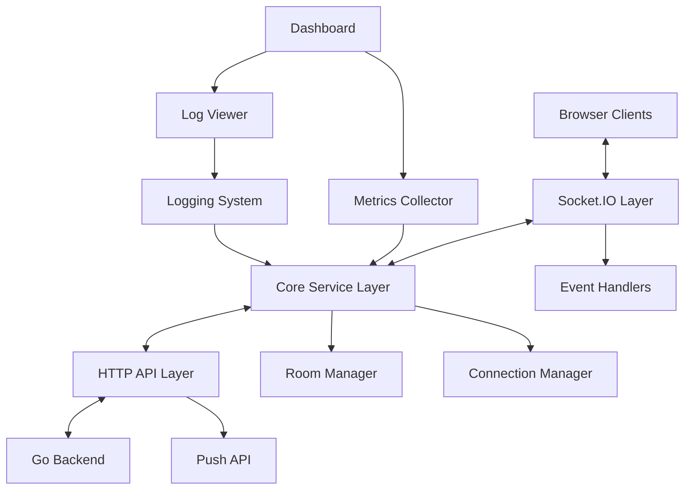
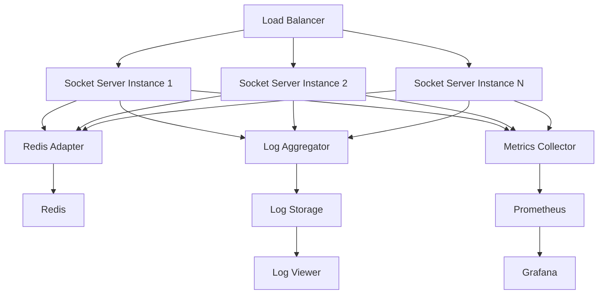

# Design Document: Socket Server

## Overview

The Socket Server is a real-time communication middleware service that acts as an intermediary layer between browser clients and the Go backend service. It handles WebSocket connections using Socket.IO, manages user connections, routes messages, and provides a monitoring dashboard. This design document outlines the architecture, components, interfaces, data models, error handling, and testing strategy for the Socket Server.

## Architecture

The Socket Server follows a layered architecture with clear separation of concerns:



### Key Components

1. **Socket.IO Layer**: Handles WebSocket connections, events, and message passing
2. **Core Service Layer**: Manages business logic, connection tracking, and room management
3. **HTTP API Layer**: Provides REST endpoints for the Go backend to push messages
4. **Dashboard**: Web interface for monitoring and administration
5. **Logging System**: Records events, errors, and system activities
6. **Metrics Collector**: Gathers performance and usage statistics

## Components and Interfaces

### 1. Socket.IO Server

**Responsibilities:**
- Accept and manage client connections
- Handle Socket.IO events
- Route messages between clients and backend
- Manage rooms and namespaces

**Interface:**
```typescript
interface SocketServer {
  initialize(): Promise<void>;
  handleConnection(socket: Socket): void;
  handleDisconnection(socket: Socket): void;
  broadcastToRoom(room: string, event: string, payload: any): void;
  emitToUser(userId: string, event: string, payload: any): boolean;
  getRooms(): Map<string, Set<string>>;
  getActiveConnections(): number;
}
```

### 2. Connection Manager

**Responsibilities:**
- Track active connections
- Map socket IDs to user IDs
- Handle authentication and registration
- Manage connection lifecycle

**Interface:**
```typescript
interface ConnectionManager {
  registerUser(socket: Socket, userId: string): void;
  removeUser(socket: Socket): void;
  getUserId(socketId: string): string | null;
  getSocketsForUser(userId: string): Socket[];
  isAuthenticated(socket: Socket): boolean;
  getActiveConnections(): Map<string, Set<Socket>>;
}
```

### 3. Room Manager

**Responsibilities:**
- Create and manage rooms
- Add/remove users from rooms
- Track room membership
- Support custom room groupings

**Interface:**
```typescript
interface RoomManager {
  addToRoom(socket: Socket, room: string): void;
  removeFromRoom(socket: Socket, room: string): void;
  removeFromAllRooms(socket: Socket): void;
  getRoomMembers(room: string): Set<Socket>;
  getUserRooms(socket: Socket): Set<string>;
  getRooms(): Map<string, Set<Socket>>;
}
```

### 4. HTTP API

**Responsibilities:**
- Accept push requests from Go backend
- Validate request format and authentication
- Route messages to appropriate clients
- Provide status and health endpoints

**Interface:**
```typescript
interface PushAPI {
  initialize(app: Express): void;
  handlePush(req: Request, res: Response): Promise<void>;
  handleStatus(req: Request, res: Response): void;
  handleHealth(req: Request, res: Response): void;
}
```

### 5. Event Handlers

**Responsibilities:**
- Process incoming Socket.IO events
- Forward events to Go backend
- Handle system events (connect, disconnect, error)
- Implement business logic for specific events

**Interface:**
```typescript
interface EventHandler {
  initialize(io: Server, socket: Socket): void;
  handleEvent(event: string, data: any): Promise<void>;
  registerHandlers(): void;
}
```

### 6. Logger

**Responsibilities:**
- Record system events and errors
- Support different log levels
- Write logs to console and files
- Implement log rotation

**Interface:**
```typescript
interface Logger {
  info(message: string, meta?: object): void;
  error(message: string, error?: Error, meta?: object): void;
  warn(message: string, meta?: object): void;
  debug(message: string, meta?: object): void;
  getRecentLogs(count: number): LogEntry[];
}
```

### 7. Metrics Collector

**Responsibilities:**
- Track system metrics (connections, messages, errors)
- Expose metrics in Prometheus format
- Calculate derived metrics (message rate, error rate)
- Support dashboard visualization

**Interface:**
```typescript
interface MetricsCollector {
  initialize(): void;
  incrementCounter(name: string, labels?: object): void;
  observeHistogram(name: string, value: number, labels?: object): void;
  setGauge(name: string, value: number, labels?: object): void;
  getMetrics(): Promise<string>;
}
```

### 8. Dashboard

**Responsibilities:**
- Display active connections and rooms
- Show system metrics and health
- Provide log viewer
- Support real-time updates

**Interface:**
```typescript
interface Dashboard {
  initialize(app: Express): void;
  getConnectionStats(): ConnectionStats;
  getRoomStats(): RoomStats;
  getSystemMetrics(): SystemMetrics;
  getRecentLogs(count: number): LogEntry[];
}
```

## Data Models

### 1. User Connection

```typescript
interface UserConnection {
  socketId: string;
  userId: string;
  connectedAt: Date;
  metadata: {
    userAgent: string;
    ip: string;
    [key: string]: any;
  };
  rooms: Set<string>;
}
```

### 2. Message

```typescript
interface Message {
  id: string;
  event: string;
  payload: any;
  timestamp: Date;
  sender: {
    type: 'client' | 'server' | 'backend';
    id: string;
  };
  recipient: {
    type: 'user' | 'room' | 'broadcast';
    id: string;
  };
}
```

### 3. Push Request

```typescript
interface PushRequest {
  userId?: string;
  roomId?: string;
  event: string;
  payload: any;
  options?: {
    volatile?: boolean;
    timeout?: number;
    [key: string]: any;
  };
}
```

### 4. System Metrics

```typescript
interface SystemMetrics {
  activeConnections: number;
  messageRate: {
    incoming: number;
    outgoing: number;
  };
  errorRate: number;
  roomCount: number;
  uptime: number;
  memoryUsage: {
    rss: number;
    heapTotal: number;
    heapUsed: number;
    external: number;
  };
}
```

### 5. Log Entry

```typescript
interface LogEntry {
  timestamp: Date;
  level: 'info' | 'warn' | 'error' | 'debug';
  message: string;
  meta?: object;
  context?: string;
}
```

## Error Handling

The Socket Server implements a comprehensive error handling strategy:

### 1. Connection Errors

- Socket.IO's built-in reconnection mechanism handles temporary disconnections
- Connection failures are logged with appropriate context
- Clients receive clear error messages with guidance on resolution
- Exponential backoff strategy for reconnection attempts

### 2. Message Routing Errors

- Failed message deliveries are logged and tracked in metrics
- Undeliverable messages may be stored temporarily for retry
- Error responses include specific error codes and descriptions
- Critical routing failures trigger alerts

### 3. API Errors

- HTTP API uses standard status codes (400, 401, 404, 500)
- Validation errors return detailed information about invalid fields
- Authentication failures are logged with limited information (no credentials)
- Rate limiting is applied to prevent abuse

### 4. System Errors

- Uncaught exceptions are logged and don't crash the server
- Process monitoring ensures automatic restart on critical failures
- Resource exhaustion (memory, connections) triggers graceful degradation
- Health checks detect and report system issues

### 5. Error Response Format

```typescript
interface ErrorResponse {
  error: {
    code: string;
    message: string;
    details?: any;
    timestamp: string;
    requestId?: string;
  };
}
```

## Testing Strategy

### 1. Unit Testing

- Test individual components in isolation with mocked dependencies
- Cover core business logic, validation, and error handling
- Achieve high code coverage for critical components
- Use Jest or Mocha/Chai for test framework

### 2. Integration Testing

- Test interaction between components
- Verify correct message flow between layers
- Test database/cache interactions if applicable
- Use containerized dependencies for realistic testing

### 3. End-to-End Testing

- Simulate client connections and message exchanges
- Test complete flows from client to backend and back
- Verify dashboard functionality
- Use Socket.IO client library for realistic client simulation

### 4. Load Testing

- Measure performance under high connection counts
- Test message throughput limits
- Identify bottlenecks and resource constraints
- Use tools like Artillery or custom load generation scripts

### 5. Security Testing

- Verify authentication and authorization mechanisms
- Test input validation and sanitization
- Check for common vulnerabilities (injection, XSS)
- Review dependency security

## Deployment Architecture

The Socket Server is designed to be deployed in a scalable, containerized environment:



### Scaling Considerations

1. **Horizontal Scaling**
   - Multiple Socket Server instances behind a load balancer
   - Redis Adapter for cross-instance message sharing
   - Sticky sessions for connection stability

2. **Vertical Scaling**
   - Node.js memory and CPU optimization
   - Connection pooling for backend communication
   - Efficient event loop utilization

3. **Future Enhancements**
   - Message queue integration (Kafka, RabbitMQ) for higher throughput
   - Sharding strategies for very large deployments
   - Edge deployment for reduced latency